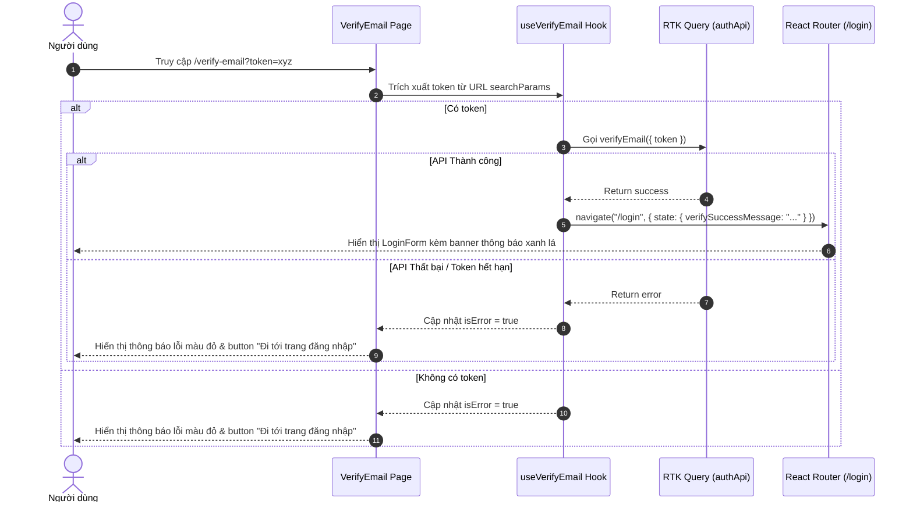

# Design Spec: Trang VerifyEmail (Task ## 10)

> **Ngày tạo:** 2026-07-22  
> **Trạng thái:** Chờ kiểm duyệt  
> **Tính năng:** Xác thực email tài khoản (`/verify-email`)

---

## 1. Tổng quan
Tính năng xác minh email cho phép người dùng kích hoạt tài khoản sau khi đăng ký bằng cách truy cập liên kết từ hòm thư email dạng `/verify-email?token=...`. Trang sẽ tự động gọi API xác thực tới server, hiển thị phản hồi trực quan và điều hướng người dùng về trang Đăng nhập (`/login`) với thông báo thành công.

---

## 2. Luồng hoạt động (Data Flow & State Transition)



---

## 3. Danh sách các file thay đổi & chức năng

### 3.1. `src/configs/path.js` (Modify)
- Thêm thuộc tính `verify_email: "/verify-email"` vào object `paths`.

### 3.2. `src/services/auth.js` (Modify)
- Thêm mutation `verifyEmail`:
  ```js
  verifyEmail: builder.mutation({
      query: (body) => ({
          url: "/auth/verify-email",
          method: "POST",
          body, // { token }
      }),
  }),
  ```
- Export hook `useVerifyEmailMutation`.

### 3.3. `src/routes.js` (Modify)
- Lazy import `VerifyEmail`: `const VerifyEmail = lazy(() => import("./pages/Auth/VerifyEmail"));`
- Thêm route `{ path: paths.verify_email, component: VerifyEmail }` vào mảng `children` của `AuthLayout`.

### 3.4. `src/features/auth/hooks/useVerifyEmail.js` (New)
- Tách biệt toàn bộ logic xác thực email ra khỏi UI:
  - Đọc `token` từ `useSearchParams()`.
  - Tự động gọi `verifyEmailApi({ token })` trong `useEffect` khi mount (dùng ref flag hoặc kiểm tra để đảm bảo chỉ gọi 1 lần khi có token).
  - Khi xác minh thành công, tự động chuyển hướng người dùng tới `paths.login` với `state: { verifySuccessMessage: t("auth:verify_email_success") }`.
  - Trả về các giá trị: `{ token, isVerifying, isError, error, handleGoToLogin }`.

### 3.5. `src/pages/Auth/VerifyEmail.jsx` (New)
- Sử dụng `AuthLayout` làm wrapper (thông qua router setup).
- Đọc trạng thái từ `useVerifyEmail()`.
- UI Render:
  - **Trạng thái đang gọi API (`isVerifying`):** Hiển thị `LoadingIcon` spinner và đoạn văn bản `"Đang xác minh..."` (`auth:verifying_email`).
  - **Trạng thái thất bại (`isError` hoặc không có token):** Không hiển thị form, chỉ hiển thị thông điệp lỗi màu đỏ `"Liên kết đã hết hạn hoặc không hợp lệ."` (`auth:verify_email_failed`) và nút Button `"Đi tới trang đăng nhập"` (`auth:go_to_login_btn`).

### 3.6. `src/pages/Auth/components/LoginForm.jsx` (Modify)
- Lấy `location.state` bằng `useLocation()`.
- Kiểm tra nếu có `location.state?.verifySuccessMessage`, hiển thị một khung thẻ thông báo màu xanh (green alert container) nằm ở vị trí giữa tiêu đề `login_title` và input nhập Email đầu tiên.

### 3.7. `public/locales/vi/auth.json` & `public/locales/en/auth.json` (Modify)
- Thêm các key dịch ngôn ngữ:
  - `"verifying_email"`: `"Đang xác minh..."` / `"Verifying..."`
  - `"verify_email_failed"`: `"Liên kết đã hết hạn hoặc không hợp lệ."` / `"Invalid or expired link."`
  - `"verify_email_success"`: `"Đã xác minh tài khoản thành công. Vui lòng đăng nhập."` / `"Account verified successfully. Please log in."`
  - `"go_to_login_btn"`: `"Đi tới trang đăng nhập"` / `"Go to login page"`

---

## 4. Kế hoạch kiểm thử (Verification Plan)
- **Manual Verification:**
  1. Truy cập `/verify-email?token=valid_token` -> Kiểm tra giao diện hiển thị spinner "Đang xác minh...", tự động chuyển về `/login` và hiển thị thông báo thành công màu xanh lá ở vị trí yêu cầu.
  2. Truy cập `/verify-email?token=invalid_token` hoặc `/verify-email` không có token -> Kiểm tra giao diện thất bại hiển thị chữ đỏ "Liên kết đã hết hạn hoặc không hợp lệ." và nút "Đi tới trang đăng nhập". Thử click nút xem có chuyển hướng về `/login` không.
  3. Chuyển đổi ngôn ngữ Tiếng Việt / Tiếng Anh -> Kiểm tra hiển thị đa ngôn ngữ chuẩn xác.
